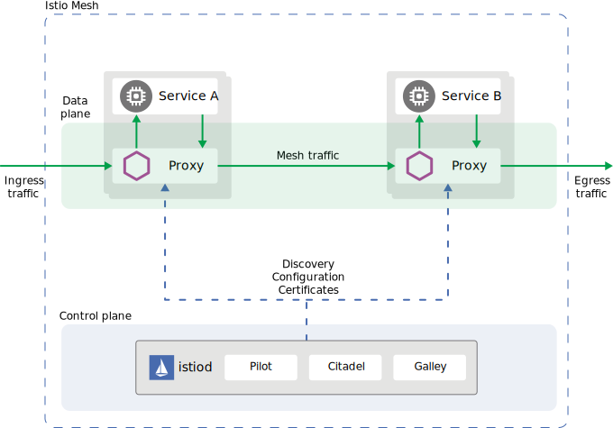

## Architecture
An Istio service mesh is logically split into a data plane and a control plane.

- The data plane is composed of a set of intelligent proxies (Envoy) deployed as sidecars. These proxies mediate and control all network communication between microservices. They also collect and report telemetry on all mesh traffic.

- The control plane manages and configures the proxies to route traffic.

The following diagram shows the different components that make up each plane:

## Components

The following sections provide a brief overview of each of Istio’s core components.

### Envoy

Istio uses an extended version of the Envoy proxy. Envoy is a high-performance proxy developed in C++ to mediate all inbound and outbound traffic for all services in the service mesh. Envoy proxies are the only Istio components that interact with data plane traffic.

Envoy proxies are deployed as sidecars to services, logically augmenting the services with Envoy’s many built-in features, for example:

- Dynamic service discovery
- Load balancing
- TLS termination
- HTTP/2 and gRPC proxies
- Circuit breakers
- Health checks
- Staged rollouts with %-based traffic split
- Fault injection
- Rich metrics

### Istiod

Istiod provides service discovery, configuration and certificate management.

Istiod converts high level routing rules that control traffic behavior into Envoy-specific configurations, and propagates them to the sidecars at runtime. Pilot abstracts platform-specific service discovery mechanisms and synthesizes them into a standard format that any sidecar conforming with the Envoy API can consume.

Istio can support discovery for multiple environments such as Kubernetes or VMs.

Istiod security enables strong service-to-service and end-user authentication with built-in identity and credential management. You can use Istio to upgrade unencrypted traffic in the service mesh. Using Istio, operators can enforce policies based on service identity rather than on relatively unstable layer 3 or layer 4 network identifiers. Additionally, you can use Istio’s authorization feature to control who can access your services.

Istiod acts as a Certificate Authority (CA) and generates certificates to allow secure mTLS communication in the data plane.