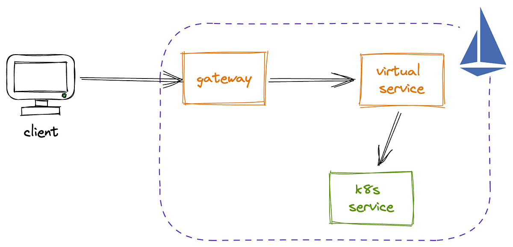

# Traffic Management

Traffic management in Istio involves controlling the flow of traffic between services in a microservices architecture. Istio provides a comprehensive set of features for traffic management, and when using the Istio Gateway API, you have even more control over how external traffic enters the service mesh. Here's an overview of traffic management in Istio with a focus on the Istio Gateway API:

## Key Concepts:
For simplicity, we'll initially focus on understanding a few key concepts. Later on, we'll take a deeper dive into each of these concepts.

### 1. **Gateway:**
   - Think of the Gateway as the grand entrance to your service mesh. It's the first point of contact for external traffic trying to get in. With Istio, you can set up the Gateway to define how this traffic, be it HTTP or HTTPS, should find its way into your microservices world. It's like the gatekeeper that directs traffic based on specified hosts and ports.

### 2. **VirtualService:**
   - Once the traffic passes through the gateway, it encounters the VirtualService, your guide to the internal workings of the service mesh. VirtualService is your rulebook—it helps decide where the traffic should go within the mesh. It allows you to set up rules based on HTTP paths, headers, and other criteria, ensuring that each request finds its intended destination.

### 3. **DestinationRule:**
   - Now that the traffic knows where to go, it meets the DestinationRule, your service concierge. This rule defines the policies that should be applied to the traffic after it reaches its intended service. These policies cover important aspects like timeouts, retries, and how the load should be balanced among instances of the service.

### 4. **Traffic Splitting:**
   - Imagine you're introducing a new version of a service. Traffic splitting in Istio allows you to be cautious and selective. You can send a portion of the traffic (let's say 10%) to the new version (a kind of sneak peek) while the majority continues to interact with the stable version. It's a smart way to test the waters without diving in completely.

### 5. **Traffic Shifting:**
   - Traffic shifting takes the gradual approach a step further. Let's say you've tested the new version, and it's ready for more action. With traffic shifting, you can smoothly transition the traffic distribution. Maybe start with 10% on the new version and slowly shift more traffic in that direction until the transition is complete.

